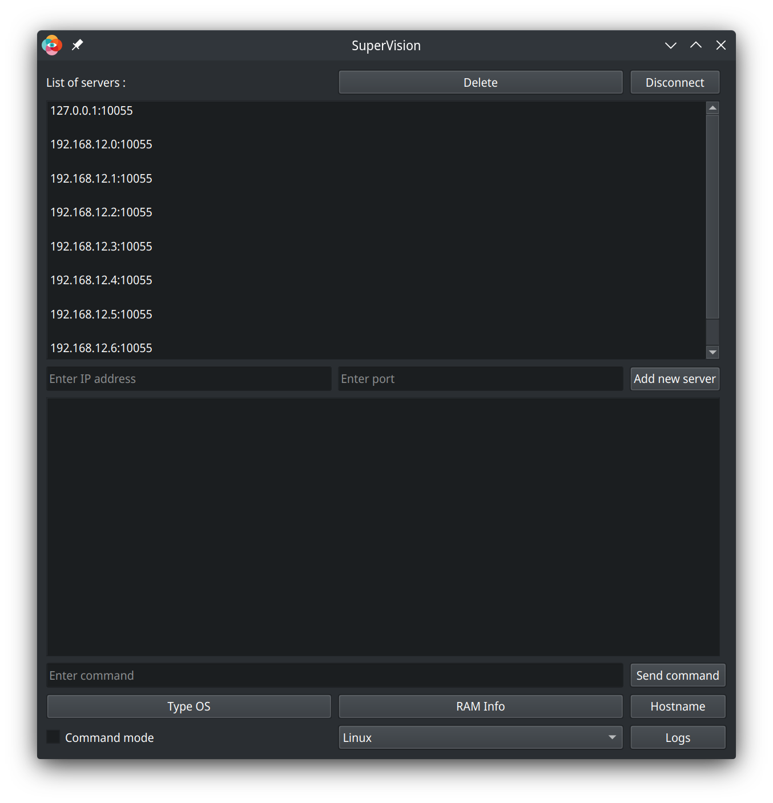
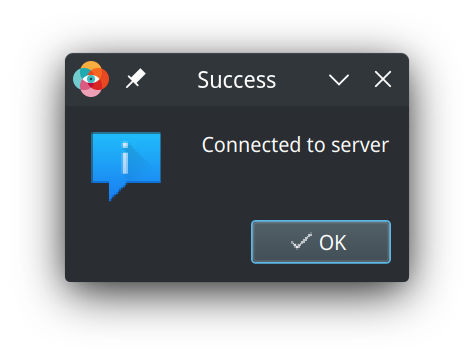
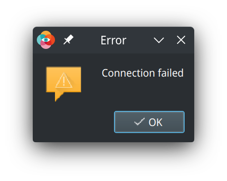
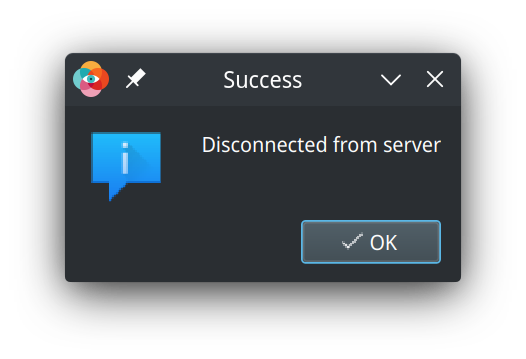
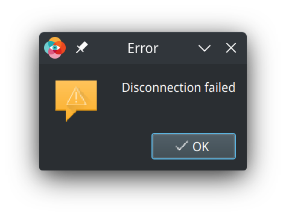
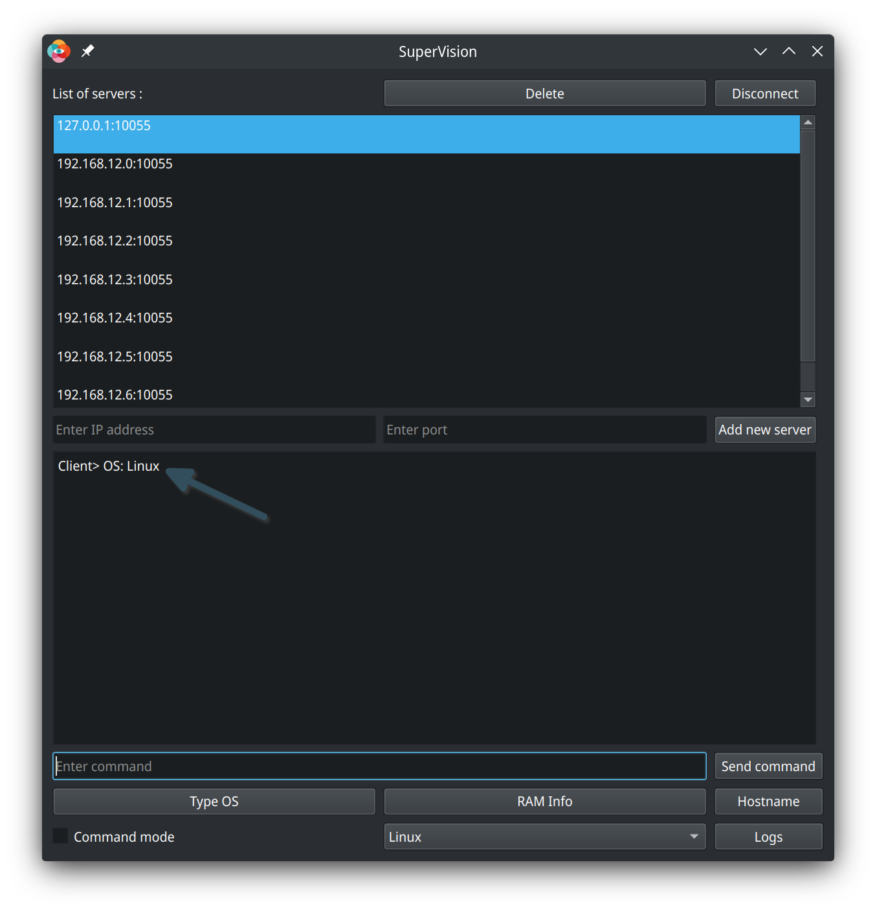
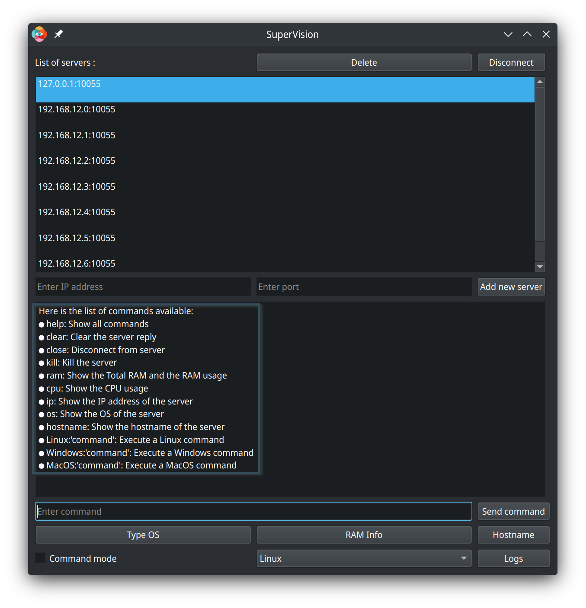
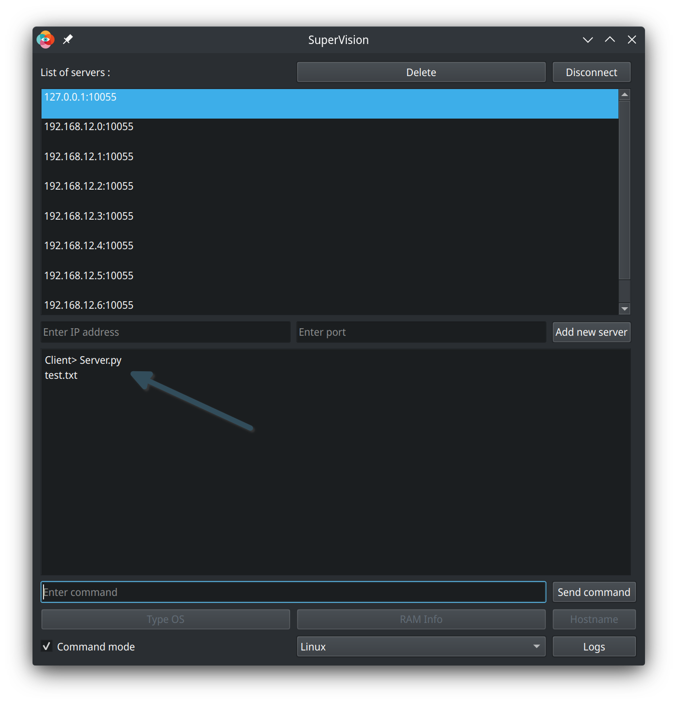

# How to use the SuperVision project ? 

In this file, I will explain how to use the SuperVision project.
Before using the SuperVision project, you need to read the [README.md](README.md) file.

Here the screenshot of the main window of the project:

## List of the servers 

At the top of the window, you can see the list of the servers that are available to you to connect to them. This list append automatically when you start the project, this work with the .csv file in the SuperVisionApp/ServersList folder.

You can add a server to this list by clicking on the "Add new server" button. Befor adding a server, you need to write the IP address of the server in the "IP address" field and the port of the server in the "Port" field. Then, you can click on the "Add new server" button to add the server to the list. Once the server is added to the list, his also added to the .csv file.

You can remove a server from the list by clicking on the "Delete" button at the top of the window. Before removing a server, you need to select the server in the list. To select a server, you need to click on the server in the list. Then, you can click on the "Delete" button to remove the server from the list. Once the server is removed from the list, his also removed from the .csv file.

## Connect to a server

To connect to a server, you need to select the server in the list. After selecting the server you just need to double click on the server in the list. Once you double click on the server, the project will try to connect to the server. 

<b>If the connection is successful, the project will display an success message.</b>

<b>If the connection is not successful, the project will display an error message like this:</b>

## Disconnect from a server

To disconnect from a server, you need to select the server in the list. After selecting the server you just need to click on the "Disconnect" button at the top of the window. Once you click on the "Disconnect" button, the project will try to disconnect from the server.

<b>If the disconnection is successful, the project will display an success message.</b>

<b>If the disconnection is not successful, the project will display an error message like this:</b>

Once you disconnect from a server, you can connect to another server. Also you can reconnect to the same server. Remember that you can't connect to a server if you are already connected to another server. So if try to connect to a server while you are connected to another server, the project will disconnect you automatically from the first server and will try to connect to the second server.

## Send a command to a server / receive a response from a server

### Send a simple command to a server

Once you are connected to a server, you can send a command to the server and receive a response from the server. To send a command to the server, you need to write the command in the "Command" field and then click on the "Send command" button. Once you click on the "Send command" button, the project will send the command to the server and will display the response in the "Server reply" field.

Example of a command: "os" (this command will return the operating system of the server)

For have more information about the commands, you can type "help" in the "Command" field and then click on the "Send command" button. This command will return a list of the commands that you can use.

Here the screenshot of the "help" command:

Also you can use some shortcuts buttons to send a command to the server. I put 3 shortcuts buttons: "TypeOS", "RAM Info" and "Hostname". To use these buttons, you just need to click on the button. Once you click on the button, the project will send the command to the server and will display the response in the "Server reply" field.(This buttons are not available if you are in the "Command mode")

### Send a command wich will be executed in the shell of the server

If you want to execute a command in the shell of the server, you need to write the command in the "Command" field with the "os" prefix before the command. For example, if you want to execute the "ls" command in the shell of the Linux server, you need to write "Linux:ls" in the "Command" field and then click on the "Send command" button. Once you click on the "Send command" button, the project will send the command to the server and will display the response in the "Server reply" field.
For Windows and MacOS servers you need to write "Windows:" or "MacOS:" before the command.

Example of a command: "Linux:ls" (this command will return the list of the files in the current directory of the Linux server)

Also you have the possibility to enter in the "Command mode" by clicking on the "Command mode" checkbox. When you are in the "Command mode", you need to choise the operating system of the server in the dropdown list at the right of the "Command mode" checkbox. After choosing the operating system of the server, you can write the shell command in the "Command" field and then click on the "Send command" button with out the "os" prefix before the command, the project will add the "os" prefix before the command automatically.
In the "Command mode", some base commands will be not available, for example the "help" and "clear" commands. For use these commands, you need to exit from the "Command mode".

In this mode you have 3 type of responses:

- If the command is executed successfully and the command have a return message, the project will display the return message in the "Server reply" field sent by the server.

- If the command is executed successfully and the command don't have a return message, the project will display the "Command executed successfully" message in the "Server reply" field.

- If the command is not executed successfully, the project will display the error message in the "Server reply" field.

Warning: If you are in the "Command mode", be careful to not send a command without a timeout. If you send a command without a timeout, the project will wait for the response of the server and will not display the response in the "Server reply" field. You will need to disconnect from the server and reconnect to the server to continue to use the project.

## Log system

And finally the log system. The log system is used to save the commands that you send to the server. To consult the log, you need to click on the "Log" button at the right-bottom of the window. Once you click on the "Log" button, the project will display the logs directory. In this directory, you can find the logs for each server. To open a log, you need to double click on the log. Once you double click on the log, the log file will be open in the default text editor of your computer.

## Conclusion

I hope that this tutorial will help you to use the project. If you have any questions, don't hesitate to create an issue on the project's github page. I will try to answer to your questions as soon as possible.